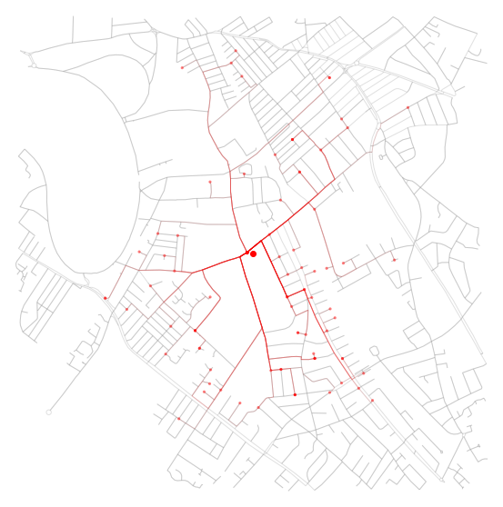
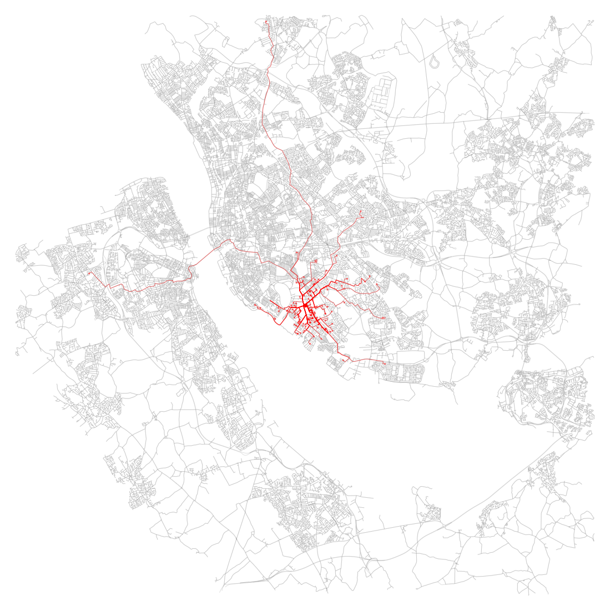
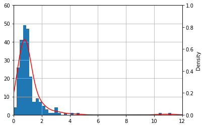
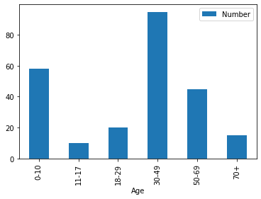
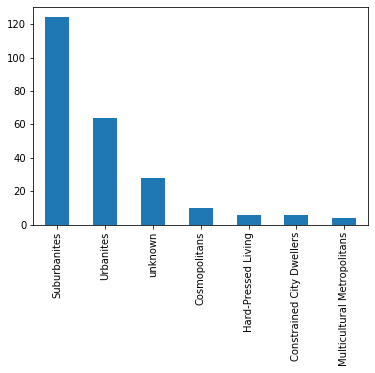

# Church Data Analysis

As part of my [PhD/MSc in Geographic Data Science](https://datacdt.org/overview/), I'm doing an internship with [my supervisor](https://www.alex-singleton.com/)'s church, [Mossley Hill Parish Church](https://mossleyhillchurch.org.uk/).

They've shared the list of postcodes from their electoral roll, and asked if I can help them understand the neighbourhoods where the members of their congregation live, so they can better serve their communities.

I've had fun doing some initial exploration of the data: they're very clearly a local church for local people, and a family church for families.

